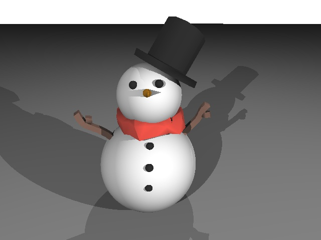
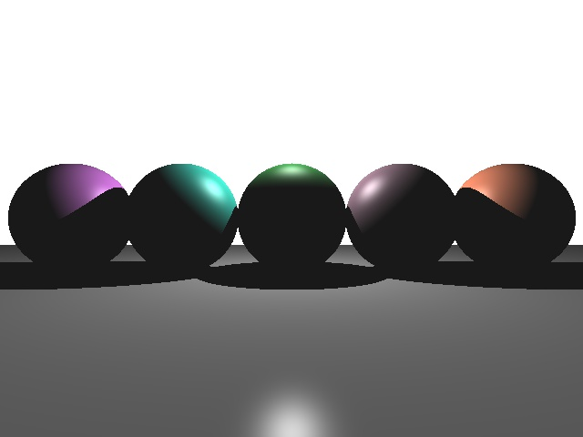

# Raytracer
Features:
- Visualization window in GLFW
- Analytic ray-triangle and ray-sphere intersections using barycentric coordinates
- Phong shading
- Anti-aliasing

Sample output:

mkdir build
cmake ..
make 
.raytracer model/
